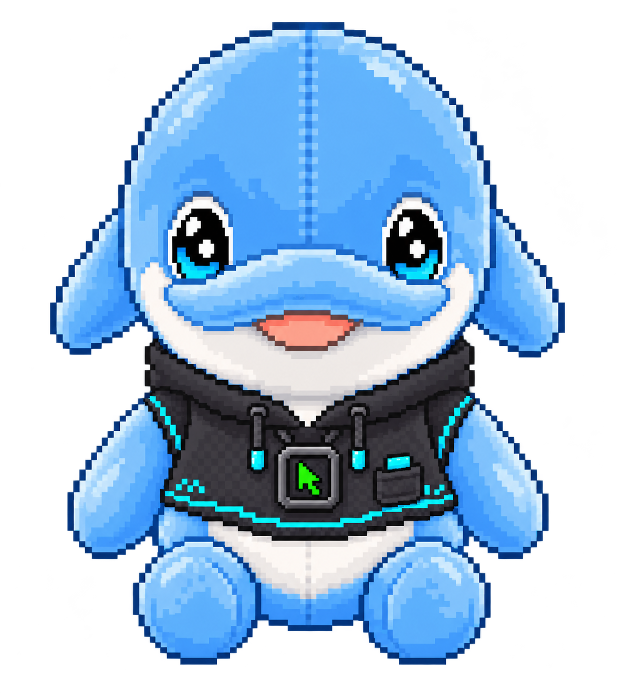

<div align="center">
  

  # Lu Wei

  `products, prototypes, and things I am still figuring out`
</div>

```text
$ whoami
我常從一個很煩的小問題開始做產品：找工作時，建議到底從哪裡來？一家人出遊時，下一站到底誰知道？做到最後，題目通常都會繞回 AI、資訊和協作。

$ focus
AI agents · evidence-led workflows · collaborative products
```

## Pinned / working on

- [求職姆姆](https://github.com/Weiqd7779/job-mumu) — 台灣求職證據分析與履歷工作站
- [Workspouse](https://github.com/Weiqd7779/Workspouse) — 可追蹤、可評估的 AI Agent 實驗框架
- [同行](https://github.com/Weiqd7779/together-travel) — 跨世代多人共遊與共享行程 Web App
- [PPTAgent](https://github.com/Weiqd7779/PPTAgent) — 用來研究 Agent 式簡報生成的開源專案 fork

<div align="center">
  <sub>駭客姆姆正在夜班。</sub>
</div>
